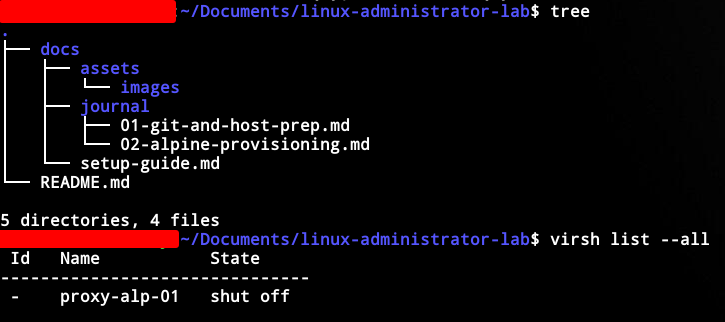

# Date: 2026-06-13
# Task: Provisioning the Alpine Gateway

## 1. Objective
Provision `proxy-alp-01` via the command line interface to serve as the edge gateway, bypassing GUI management tools to simulate a modern, headless data center deployment.

## 2. Troubleshooting & Remediation
* **Issue 1:** `virt-install` failed to locate the `admin-lab` storage pool.
  * *Root Cause:* Command executed in the local user session (`qemu:///session`) rather than the system hypervisor.
  * *Fix:* Appended `--connect qemu:///system` to the command.
* **Issue 2:** `Requested operation is not valid: network 'default' is not active`.
  * *Root Cause:* The KVM virtual router did not auto-start upon installation.
  * *Fix:* Executed `virsh net-start default` and `virsh net-autostart default`.
* **Issue 3:** Virtual console locked up during OS extraction to the virtual disk.
  * *Root Cause:* KVM provisioned the virtual disk as an emulated IDE controller (`sda`), creating a severe I/O software bottleneck on the host.
  * *Fix:* Modified the provisioning command to utilize the `virtio` bus (`vda`), allowing direct, high-speed access to the physical SSD controller.

## 3. Provisioning Execution
Successfully allocated a 5GB `qcow2` virtual drive on the secondary storage pool and booted the Alpine 3.24 live CD.

```bash
# Headless VM Provisioning Command

virt-install \
  --connect qemu:///system \
  --name proxy-alp-01 \
  --memory 1024 \
  --vcpus 1 \
  --disk pool=admin-lab,size=5,format=qcow2,bus=virtio \
  --cdrom /mnt/Daraz_SSD/linux-lab/Alpine/alpine-virt-3.24.0-x86_64.iso \
  --os-variant generic \
  --network network=default \
  --graphics vnc \
  --noautoconsole
```

### Command Breakdown:
* `virt-install`: The command-line tool for provisioning new virtual machines via libvirt.
* `--connect qemu:///system`: Explicitly connects to the system-wide hypervisor daemon, bypassing the unprivileged user session.
* `--name proxy-alp-01`: Assigns the libvirt domain name (used for management commands).
* `--memory 1024`: Allocates 1024 MB (1 GB) of RAM to the guest OS.
* `--vcpus 1`: Allocates a single virtual CPU thread to the guest OS.
* `--disk`: Configures the storage backend.
  * `pool=admin-lab`: Directs creation to a specific pre-configured storage pool.
  * `size=5`: Defines the maximum capacity as 5 GB.
  * `format=qcow2`: Uses qcow2 for thin provisioning (only consumes physical space as data is written).
  * `bus=virtio`: Critical optimization; utilizes paravirtualized drivers to bypass IDE emulation bottlenecks.
* `--cdrom [...]`: Mounts the specified ISO image as a virtual optical drive for the initial boot.
* `--os-variant generic`: Optimizes KVM parameters for a generic Linux kernel.
* `--network network=default`: Attaches the VM to the KVM default NAT virtual router.
* `--graphics vnc`: Provisions a virtual display buffer accessible via VNC clients.
* `--noautoconsole`: Prevents `virt-install` from automatically attempting to launch a viewer, allowing headless background execution.

## 4. Verification
After utilizing `setup-alpine` via the virtual console to commit the OS to the `vda` block device, the system was rebooted and the console was detached.

```bash
# Remote Access Verification

virsh net-dhcp-leases default
ssh sysadmin@192.168.122.141
```

### Command Breakdown:
* `virsh net-dhcp-leases default`: Queries the libvirt network daemon (`virsh`) for active DHCP IP addresses assigned on the `default` virtual network.

* `ssh sysadmin@192.168.122.141`: Establishes a secure shell (`ssh`) connection to the remote host using the standard user account (`sysadmin`).

### 5. Final State Verification
Verified the documentation directory structure and confirmed the Alpine VM is successfully provisioned and currently resting in a `shut off` state.


