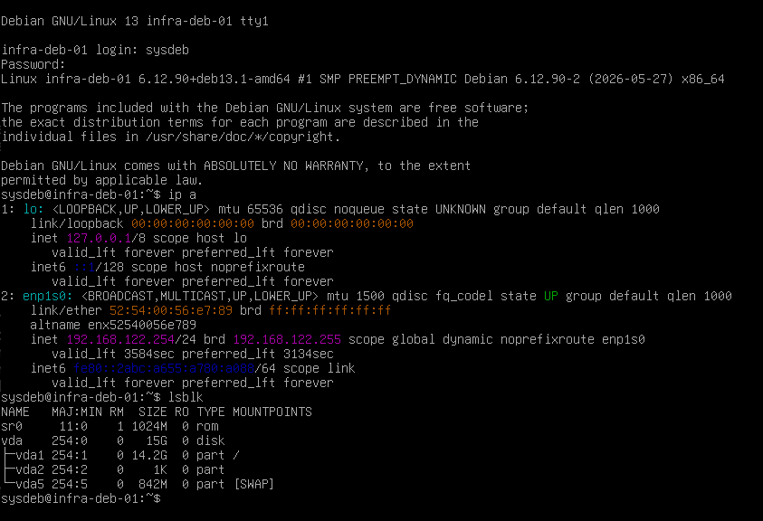

# Deployment Log: Core Infrastructure Node (infra-deb-01)
**Date:** 2026-06-18
**Engineer:** M. Mazhar
**Target:** KVM/libvirt (System URI)
**Role:** Internal Network Services (DNS/DHCP)

## 1. Deployment Overview
Provision a highly stable, headless Debian 13 node to serve as the core infrastructure backbone for the virtual lab environment. To preserve the 16GB host memory ceiling, the node was allocated a strict 1024MB of RAM and provisioned without a desktop environment (GUI).

## 2. Execution Runbook
The node was provisioned utilizing the `virtio` paravirtualized storage bus to prevent I/O emulation bottlenecks previously observed during the edge gateway deployment.

```bash
virt-install \
  --connect qemu:///system \
  --name infra-deb-01 \
  --memory 1024 \
  --vcpus 1 \
  --disk pool=admin-lab,size=15,format=qcow2,bus=virtio \
  --cdrom /mnt/Daraz_SSD/linux-lab/Debian/debian-13.5.0-amd64-netinst.iso \
  --os-variant debian12 \
  --network network=default \
  --graphics vnc \
  --noautoconsole
```

## 3. Storage Architecture Decision
**Partitioning Scheme:** Unified Root (`/`)
* **Context:** The assigned virtual block device (`vda`) is constrained to 15GB.
* **Decision:** Rejected legacy micro-partitioning (separating `/var`, `/home`, etc.) in favor of a single unified partition. 
* **Justification:** Slicing a 15GB drive into smaller logical boundaries artificially increases the risk of isolated partition exhaustion (e.g., `/var` filling up while `/home` remains empty). Service logging will be managed via log rotation policies rather than physical disk boundaries.

## 4. Validation & Standby State
Post-installation validation was performed directly via the hypervisor console. 
* **Storage:** Verified via `lsblk` that the KVM successfully passed the 15GB paravirtualized drive, resulting in a 14.2G unified root partition (`vda1`).
* **Networking:** Verified via `ip a` that the virtual NIC (`enp1s0`) successfully pulled the IPv4 lease `192.168.122.254` from the virtual router.

Following validation, the node was gracefully powered down via the host to reclaim memory overhead for subsequent lab deployments.

```bash
# Host command to place node in standby
virsh shutdown infra-deb-01
```


