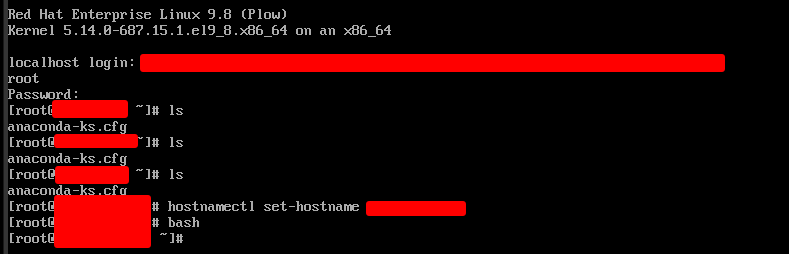

# Deployment & RCA: Enterprise Identity Node (auth-rhel-01)
**Date:** 2026-06-18
**Engineer:** M. Mazhar
**Target:** KVM/libvirt (System URI)
**Role:** Identity, Directory Services (FreeIPA), and Database

## 1. Deployment Overview
Provision an enterprise-grade Red Hat Enterprise Linux (RHEL) 9 node to handle sensitive identity management and database workloads. The node was allocated 2048MB of RAM and provisioned headlessly utilizing a Red Hat Developer subscription for CDN entitlement.

## 2. Incident Report: Host Power Loss & State Corruption
During the initial extraction of the operating system to the virtual disk, the physical hypervisor host suffered an unexpected power cycle.

* **Symptom:** Upon host recovery, the virtual machine failed to boot, dropping into SeaBIOS with a fatal `No bootable device` error.
* **Root Cause Analysis:** The sudden power loss severed the installation before the Anaconda installer could write the GRUB bootloader signature to the `vda` disk sector. The KVM hypervisor brought the machine online, but the virtual drive was fundamentally corrupted.
* **Remediation:** In accordance with disposable infrastructure principles, the corrupted state was not salvaged. The hanging QEMU process was destroyed, and the XML configuration and orphaned storage volumes were purged from the hypervisor.

```bash
# Infrastructure Cleanup Runbook
virsh destroy auth-rhel-01
virsh undefine auth-rhel-01 --remove-all-storage
```

## 3. Re-Deployment Execution
Following the hypervisor cleanup, the provisioning command was successfully re-executed. 

```bash
virt-install \
  --connect qemu:///system \
  --name auth-rhel-01 \
  --memory 2048 \
  --vcpus 2 \
  --disk pool=admin-lab,size=20,format=qcow2,bus=virtio \
  --cdrom /mnt/Daraz_SSD/linux-lab/RHEL/rhel-9.8-x86_64-boot.iso \
  --os-variant rhel9.0 \
  --network network=default \
  --graphics vnc \
  --noautoconsole
```

## 4. Architecture Decisions
* **Entitlement:** System registered to Red Hat CDN during installation. `Insights` daemon disabled to preserve the strict 2GB memory ceiling.
* **Attack Surface Reduction:** Selected `Minimal Install` base environment. Bypassed default GUI and auxiliary network tools to ensure zero-trust baseline prior to automated configuration.
* **Configuration Drift Resolution:** Hostname defaulted to `localhost` post-installation. Rectified via CLI: `hostnamectl set-hostname auth-rhel-01`.

## 5. Standby State
Node gracefully powered down from the host to reclaim 2GB memory overhead for subsequent lab deployments.

```bash
virsh shutdown auth-rhel-01
```


