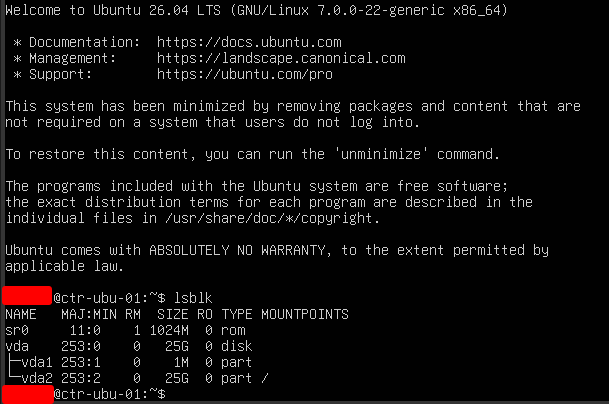

# Deployment Log: Container Orchestration Node (cntr-ubu-01)
**Date:** 2026-06-18
**Engineer:** M. Mazhar
**Target:** KVM/libvirt (System URI)
**Role:** Cloud-Native Workloads & Docker Host

## 1. Deployment Overview
Provision an Ubuntu Server instance dedicated to containerized application hosting. Given the high resource demands of concurrent Docker containers, the node was allocated 4096MB of RAM and 2 vCPUs. 

## 2. Execution Runbook
The node was deployed using the `ubuntu24.04` KVM variant optimization.

```bash
virt-install \
  --connect qemu:///system \
  --name cntr-ubu-01 \
  --memory 4096 \
  --vcpus 2 \
  --disk pool=admin-lab,size=25,format=qcow2,bus=virtio \
  --cdrom /mnt/Daraz_SSD/linux-lab/Ubuntu/ubuntu-24.04-live-server-amd64.iso \
  --os-variant ubuntu24.04 \
  --network network=default \
  --graphics vnc \
  --noautoconsole
```

## 3. Architecture Decisions
* **OS Baseline:** Selected `Ubuntu Server (minimized)` rather than the standard installation. This strips out non-essential utilities (e.g., `lxd`, `snapd` components, heavy man pages) to maximize available CPU cycles and memory for the Docker daemon.
* **Storage Allocation:** Explicitly bypassed the default LVM (Logical Volume Management) configuration. 
    * *Justification:* The Ubuntu installer's LVM default arbitrarily caps the root logical volume at 50% of the physical disk space. By disabling LVM, the full 25GB virtual drive was allocated to the unified `/` root partition, preventing premature "Disk Full" errors during heavy container image pulls.
* **Package Management:** Bypassed all GUI prompts for "Featured server snaps" (including Docker). The container engine will be installed natively via the official `apt` repository post-deployment to ensure IaC compliance and avoid Snap loopback mount permission conflicts.

## 4. Standby State
Following the completion of the installation and a successful boot sequence verification, the node was gracefully powered down from the hypervisor host to reclaim the 4GB memory overhead.

```bash
virsh shutdown cntr-ubu-01
```


