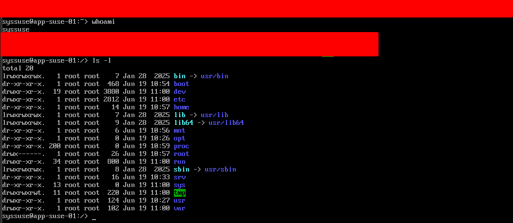

# Deployment Log: Configuration & Application Node (app-suse-01)
**Date:** 2026-06-19
**Engineer:** M. Mazhar
**Target:** KVM/libvirt (System URI)
**Role:** Primary Configuration Target (Ansible) & Web Services

## 1. Deployment Overview
Provision an openSUSE Leap 16.0 node to introduce OS heterogeneity into the virtual data center. Integrating a `zypper`/RPM-based distribution alongside Debian (`apt`) enforces advanced Infrastructure as Code (IaC) logic, requiring automation scripts to dynamically detect operating systems and apply conditional package management.

## 2. Execution Runbook
The node was provisioned with 2048MB of memory to support the YaST installation framework and future Apache/web workloads.

```bash
virt-install \
  --connect qemu:///system \
  --name app-suse-01 \
  --memory 2048 \
  --vcpus 2 \
  --disk pool=admin-lab,size=15,format=qcow2,bus=virtio \
  --cdrom /mnt/Daraz_SSD/linux-lab/Opensuse/openSUSE-Leap-16.0-DVD-x86_64.iso \
  --os-variant opensuse15.0 \
  --network network=default \
  --graphics vnc \
  --noautoconsole
```

## 3. Incident Report: VNC Framebuffer Race Condition
* **Symptom:** Initial deployment resulted in a `No bootable device` SeaBIOS crash due to an empty primary drive.
* **Root Cause Analysis:** The openSUSE installation media defaults to booting from the local hard disk rather than the installer. KVM spun up the virtual hardware and initiated the boot countdown faster than the `virt-viewer` VNC graphical buffer could render on the host display. By the time the console was visible, the timer had expired, attempting a boot from the unformatted 15GB drive.
* **Remediation:** The corrupted instance was destroyed (`virsh destroy app-suse-01`) and the storage purged. Upon reprovisioning, a "pre-emptive keystroke" strategy was utilized. Keystrokes (Down Arrow) were forcefully injected into the hypervisor's keyboard buffer the millisecond the VNC window spawned—prior to graphical rendering—successfully arresting the bootloader countdown and initiating the YaST installer.

## 4. Architecture Decisions
* **Filesystem Engineering (Btrfs):** Deliberately bypassed the `ext4` standard used on the Debian and Ubuntu nodes in favor of **Btrfs** for the root (`/`) partition. 
    * *Justification:* Btrfs natively supports pre-execution snapshotting. This allows for instant, sector-level rollbacks of the operating system if an experimental automation script or package upgrade breaks the node's configuration.

## 5. Standby State
Following validation, the node was gracefully powered down via the host to reclaim memory.

```bash
virsh shutdown app-suse-01
```


